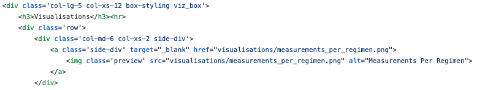
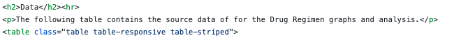
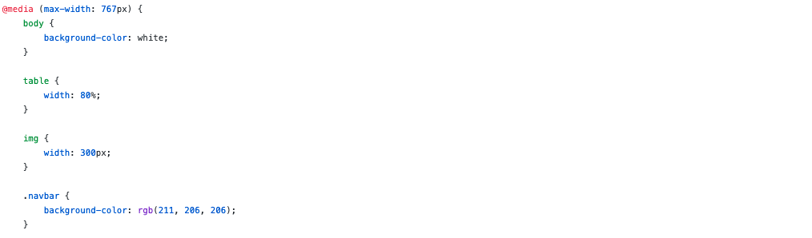

### web-design-challenge

### Click the image to see the website

#### contains
- html_pages: folder containing all HTML pages save the landing page
    - capo_avg_tum.html		
    - infu_avg_tum.html
    - comparisons.html		
    - measurements_per_regimen.html
    - data.html			
    - rand_mouse_tum_vol.html
    - final_tum_size.html
- index.html: the landing page for the website
- resources: folder containing the source Jupyter Notebook
    - drug_regimens_source-book.ipynb
- style.css: CSS file with additional stylings to the webpages
- visualisations: folder containing the images used within the website
    - capomulin_avg_tum_size_linreg.png	
    - measurements_per_regimen.png
    - final_tumor_size_boxplot.png		
    - rand_mouse_tum_vol.png
    - infubinol_avg_tum_size_linreg.png

#### description
The goal of this project was to create a series of webpages to showcase a previous project contained in this GitHub, [matplotlib-challenge](https://github.com/sarahDH615/matplotlib_challenge). Five visualisations were chosen from that project for display on individual webpages with explanatory text largely derived from the matplotlib project. A Comparisons page, showing all the images together, and a Data page, showing the source dataframe, were also created. Bootstrap and GitHubPages were used as tools to respectively style and display the website. The following steps were taken:
- obtaining source materials:
    - copying the matplotlib-challenge notebook and saving it to this repository
    - using the functions save-fig and .to_html to create images of the main graphs, and the cleaned source table
    - saving the outputs of the save-fig function to the visualisations folder as .pngs
    - saving the output of the .to_html function as data.html to later add in more html to make a functional webpage around it
- creating html files for each webpage
    - content shared across each html sheet:
        - including links to the bootstrap stylesheet and to a one created for dealing with media queries, style.css
        - creating a navigation bar that included a button, labelled with the name of the project ('Drug Regimens Project'), aligned left, and which would take the viewer back to the landing page if clicked; a 'Plots' dropdown menu containing links to all image pages, aligned right; links to the Comparisons and Data pages, also aligned right
        - using Bootstrap grids to design the navigation bar to react to smaller screens by hiding the right aligned links behind a button, and turning the bar background grey 
    - content shared across most sheets (the image-bearing pages and the landing page):
        - creation of a 'Visualisations' sidebar, containing preview images of the five visualisations, which, if clicked upon, would open the image
        - using Bootstrap grids to design the Visualisations sidebar to be side-by-side the main content at large screen widths, and underneath it for medium and under screen widths
        - using Bootstrap grids to design the Visualisations sidebar images to display two images across on medium and above screens, and four in a row on smaller and extra small screens
    - Comparisons page:
        - using Bootstrap grids to design the page to display two images across on medium and above screens, and one per row on smaller and extra small screens
        - creating links within each image that would take the viewer to the corresponding Plots page
    - Data page:
        - using Bootstrap to style the .to_html derived table as striped
        - using Bootstrap to design the page to show the full table on large and above screens, and to horizontally scroll on medium and below screens
    - Plots pages:
        - using Bootstrap grids to design a main page section, containing a visualisation and a short explanation of it, which would sit side-by-side the sidebar at medium screen widths and above, and above the sidebar at small screen widths and below
    -  Landing/Home page (index.html):
        - using Bootstrap grids to design a main page section, containing  a short explanation of the matplotlib project, which would sit side-by-side the sidebar at medium screen widths and above, and above the sidebar at small screen widths and below

  
  

<nl>

    <em>A couple examples of use of Bootstrap components: a screen-size-dependent row, and a striped, scrollable table.</em>

- creating the style.css file:
    - creating additional styling for the desktop-screen display of the webpages: background colors, link hover actions, and styling the preview images
    - creating media queries for page widths smaller than 768 pixels: changing navbar color scheme, images sizes, and various margin amounts

  

<nl>

    <em>A few of the elements changing depending on screen size through use of media queries.</em>

- deploying the page to GitHub Pages
        
#### challenges

The greatest challenge in this project was correctly styling the pages. In working through styling the pages, limitations in customisability and flexibility were found with using Bootstrap. Several colors are available for different elements, but not a full range, and some behaviors of the available classes (such as the margins and paddings of nested grids) are not fully explained in the documentation. This resulted in additions to the style.css file in order to change these standard features. On the other hand, Bootstrap's pre-determined classes were helpful for easily creating the navigation bar collapse. Overall, tools such as Bootstrap do not take away the need for a style sheet of one's own, but it greatly helps set up key and impressive elements of a webpage. 
